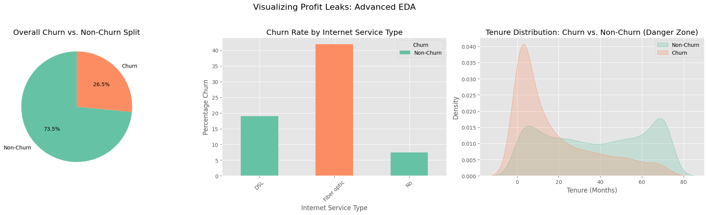

# 🚀 ChurnGuard AI  
### Enterprise Customer Retention & Revenue Optimization System
## 🧠 Business Problem

Telecommunication companies such as :contentReference[oaicite:0]{index=0} and :contentReference[oaicite:1]{index=1} operate in highly competitive markets where **customer retention is critical to revenue sustainability**.

A major challenge is **“Silent Churn”** — a phenomenon where customers gradually disengage by reducing usage, delaying recharges, or switching providers without explicit cancellation signals.

### 🚨 Key Business Challenges

- **Lack of early warning systems**  
  Churn is often detected only after the customer has already left

- **High Customer Acquisition Cost (CAC)**  
  Acquiring new users is **5–7x more expensive** than retaining existing ones

- **Inefficient marketing strategies**  
  Broad campaigns target all users instead of focusing on high-risk segments

- **Revenue leakage**  
  High-value customers may leave unnoticed, leading to significant financial loss

---

### 🎯 Problem Statement (Enterprise-Level)

Telecom operators lack predictive and explainable systems capable of identifying high-risk customers before churn occurs. This results in reactive decision-making, inefficient resource allocation, and substantial revenue loss.

---

### 💡 Solution Approach

ChurnGuard AI addresses this problem by transforming telecom data into:

- 🔮 Predictive intelligence (who will churn)
- 🧠 Explainable insights (why churn happens)
- 🎯 Actionable strategies (what to do)
- 💰 Financial visibility (revenue at risk)

👉 Enabling a shift from **reactive retention → proactive revenue protection**
## 📌 Overview

**ChurnGuard AI** is an end-to-end machine learning system designed to help telecom operators predict, explain, and reduce customer churn using data-driven decision-making.

It transforms raw customer data into:

- 🔮 Churn predictions  
- 🧠 Explainable insights (SHAP)  
- 🎯 Retention strategies  
- 💰 Revenue impact estimation  
- 🌐 Interactive business dashboard  



### Key challenges:
- Customers leave without early warning (silent churn)
- High cost of acquiring new customers vs retaining existing ones
- Generic marketing campaigns with low conversion rates


## 🎯 Objective

Build a complete AI system that enables telecom operators to:

- Predict which customers are likely to churn
- Understand why they are leaving
- Recommend targeted retention actions
- Estimate financial risk in real time


## ❓ Key Business Questions

This system answers critical business questions:

- Which customers are at risk of churn?
- What factors are driving churn behavior?
- Which customer segments are most vulnerable?
- What action should be taken for each risk group?
- How much revenue is at risk?


## 🏗️ System Architecture

Data Ingestion
↓
Data Cleaning & Preprocessing
↓
Feature Engineering
↓
Machine Learning Models (XGBoost)
↓
Explainable AI (SHAP)
↓
Decision Engine (Retention Strategy)
↓
Streamlit Dashboard (Business Interface)
## 🌐 Live Demo

🚀 Experience the system in action:

👉 **Streamlit App:**  
https://churnguard-ai-enterprise-customer-retention-system-5jpeqyf8a4n.streamlit.app/

---

### 🔍 What You Can Do:

- 📊 View real-time business KPIs  
- 👤 Analyze individual customer churn risk  
- 🧠 Understand predictions using SHAP explanations  
- 🧪 Run "What-if" simulations  
- 🎯 See recommended retention strategies  


## 📊 Dataset

- **Telco Customer Churn Dataset** (~7,000 customers)
- **Scaled Dataset Simulation** (~100,000 customers for scalability testing)

Features include:
- Tenure
- Contract type
- Monthly charges
- Internet service
- Customer demographics
- Support services


## 🔬 Methodology

### 1. Data Preprocessing
- Handling missing values
- Encoding categorical variables
- Feature scaling

### 2. Exploratory Data Analysis (EDA)
- Churn distribution analysis
- Contract vs churn behavior
- Tenure-based risk patterns


### 3. Feature Engineering
- Service usage aggregation
- Customer behavior indicators
- Charge-based risk features

### 4. Modeling
- Logistic Regression (baseline)
- Random Forest
- **XGBoost (final production model)**

### 5. Model Evaluation
- ROC-AUC
- Precision, Recall, F1-score
- Confusion Matrix analysis

### 6. Explainability
- SHAP global feature importance
- SHAP local explanations (per customer)

### 7. Decision Engine
- Converts probabilities into business actions

### 8. Deployment
- Streamlit-based interactive dashboard


## 🤖 Machine Learning Models

| Model                | Purpose        |
|---------------------|----------------|
| Logistic Regression | Baseline model |
| Random Forest      | Non-linear patterns |
| XGBoost            | Final production model |


## 📈 Model Performance

| Metric      | Score |
|------------|------|
| ROC-AUC    | ~0.89 |
| Recall     | High (optimized for churn detection) |
| Precision  | Balanced |


## 🔍 Explainable AI (SHAP)

ChurnGuard AI uses SHAP to ensure transparency:

### Global Explanation:
- Identifies top drivers of churn across all customers

### Local Explanation:
- Explains why a specific customer is predicted to churn

---

## 🎯 Decision Engine

The system converts predictions into actions:

| Churn Probability | Business Action |
|------------------|----------------|
| > 0.80           | Call + Discount Offer |
| 0.60 – 0.80      | SMS Promotion |
| < 0.60           | No action required |


## 💰 Business Impact

- Early identification of high-risk customers
- Reduced churn rate through proactive intervention
- Improved marketing targeting efficiency
- Revenue retention optimization

---

## 🌐 Streamlit Dashboard Features

### 📊 Business Overview
- Total customers
- High-risk customers
- Revenue at risk

### 👤 Customer Analysis
- Individual churn prediction
- Risk classification
- Recommended action

### 🧠 Explainability Panel
- SHAP global insights
- SHAP local explanations

### 🧪 What-if Simulation
- Test changes in tenure and charges
- Observe churn probability changes


## 🛠️ Tech Stack

- Python
- Pandas, NumPy
- Scikit-learn
- XGBoost
- SHAP (Explainable AI)
- Streamlit
- Matplotlib & Seaborn


## 📁 Project Structure


## 🚀 How to Run

```bash
https://github.com/Muradamen/ChurnGuard-AI-Enterprise-Customer-Retention-System.git
cd churnguard-ai

pip install -r requirements.txt

streamlit run app/streamlit_app.py
````


## 🧠 Key Takeaways

* Built a full end-to-end ML system
* Integrated explainable AI for transparency
* Designed a business decision engine
* Delivered a production-ready dashboard


## 🔮 Future Improvements

* Real-time streaming data integration
* API-based model deployment (FastAPI)
* Customer lifetime value (CLV) modeling
* A/B testing for retention strategies
* Cloud deployment (AWS/GCP)


---

💡 This dashboard simulates how telecom decision-makers interact with AI-powered systems in real-world environments.
## 👨‍💻 Author

**Murad Amin**
Data Scientist | AI Engineer | Full-Stack Developer

linkedin:www.linkedin.com/in/muradamin
 github: https://github.com/Muradamen
